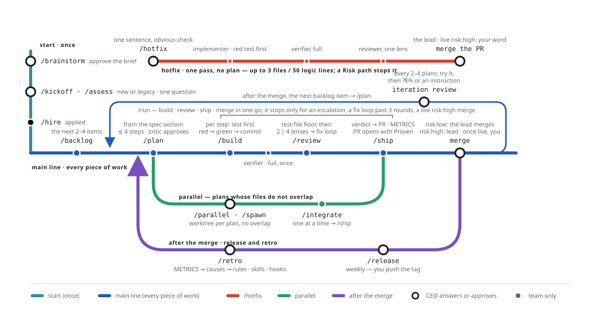

# GARAGISTE

> I would have started in a garage like the big ones did, but my apartment doesn't have one. So I built a garage out of a folder of config files.

The garage is one folder of config files, the engine is an off-the-shelf LLM, and there is no factory. What you get is a small software company that runs plan → implement → verify → review → ship — and a guide for what the human is supposed to do.

GARAGISTE is an autonomous development team template that works nearly identically in **opencode** and **Claude Code**: six core agents (lead · planner · critic · implementer · reviewer · verifier) — Claude Code adds a seventh, team-builder, for in-session parallel implementation (`/parallel`) — commands that encode a company's operating loops (`/kickoff` `/plan` `/run` `/review` `/ship` `/release` `/retro` `/handoff` `/resume` …), a merge policy inferred from repository state, a status board that survives sessions, and a human-facing guide.

한국어 문서: [README.ko.md](README.ko.md) · [opencode/GUIDE.ko.md](opencode/GUIDE.ko.md) · [claude/GUIDE.ko.md](claude/GUIDE.ko.md)

## The workflow in one picture


Blue is the path every piece of work takes: `/backlog` → `/plan` → `/build` → `/review` → `/ship` → merge, with `/run` driving the three middle stops in one go. Red is `/hotfix`, one pass without a plan for a change you can state in one sentence. Green is parallel work: `/parallel` (Claude Code) or `/spawn` (opencode), then `/integrate` before `/ship`. Purple is what happens after a merge: `/release` weekly, `/retro` when failures repeat, then the next `/plan`. Double rings mark the stops where you answer or approve; the team passes every other stop on its own.

## Install
```
./install.sh claude   -Project <repo path>      # Claude Code flavor
./install.sh opencode -Project <repo path>      # opencode flavor
.\install.ps1 claude  -Project <repo path>      # Windows PowerShell
```
Omit `-Project` for the current directory, use `-Global` for a global install. Options are identical across flavors; both `--project` and `-Project` spellings work.
In the first session, write the product brief with `/brainstorm` (talk it through with the lead, or bring a document you wrote), then start a new project with `/kickoff` or a legacy codebase with `/assess`; each is followed by `/hire`, which assigns models per role.

## Layout
```
garagiste/
  install.sh / install.ps1     # entry point: <opencode|claude> [options]
  opencode/                    # opencode flavor (agents · commands · skills · plugins installed as .opencode/, plus GUIDE.md)
  claude/                      # Claude Code flavor (agents · skills · hooks installed as .claude/, plus GUIDE.md)
  scripts/                     # maintainer tools for this repository (parity check and its baseline, hook check, map builder; never installed)
  assets/                      # the workflow map shown above (English and Korean)
```
Each flavor's `GUIDE.md` is the human manual (install, what to do in each situation, checklists); its `README.md` is the configuration reference. Agent prompts are English; agents respond in the language set under `## Language` in the project's rules file (AGENTS.md / CLAUDE.md), asked once at the start of `/brainstorm` and changed any time with `/lang <code>`; when unset they mirror the CEO's language.

## Keeping the flavors in step
Both flavors are edited by hand, so a change to a command, agent or guide belongs in both. Before a PR, run
```
node scripts/parity-check.mjs
```
It pairs every `claude/` file with its `opencode/` counterpart, translates the claude side into opencode vocabulary (CLAUDE.md → AGENTS.md, AskUserQuestion → the question tool, `/parallel` → `/spawn`, …) and reports where the remaining difference moved away from the accepted divergence recorded in `scripts/parity-baseline.txt`. It also checks that the flavor READMEs name the same commands and artifacts, that the four `scripts/*.mjs` are identical, and that each `.ko.md` keeps the section structure of its English original. A reported line is either a fix owed to the other flavor or a deliberate difference; for the latter, `--update` records it, and the baseline's diff shows reviewers what diverged.

`node scripts/hook-check.mjs` is the companion for the guardrails: it feeds a matrix of commands, paths and roles to the Claude Code hook and the opencode plugin (destructive commands, secret files, the push policy, gh api mutations, the role allow-lists) and fails on any verdict that differs from the expected one. Run it after touching `guardrails.mjs` or `guardrails.ts`.

## Six principles
1. Separate judgment from execution — the implementer does not grade its own work, the reviewer does not fix, the lead does not write code.
2. Without a verification oracle the team is a plausible-code generator — the first task is a test suite that runs in under a minute.
3. State lives in the repository, not the session — commits and plan files; a local status board (`docs/STATUS.md`, git-ignored) only points at them.
4. Gates are enforced by the repository, not the prompt — the merge policy is derived from remote, branch protection and auto-merge settings.
5. Mechanical changes and logic changes never share a commit.
6. Failures flow back into rules, skills and hooks through `/retro`. The repository remembers, not the human.

## Status
Opinionated template, v0.x. The ingredients (plan first, test oracles, small diffs, worktree isolation, fresh-context review) are widely validated; this arrangement has not been benchmarked. Watch `docs/METRICS.md` and cut what does not earn its keep.

## License
MIT — see [LICENSE](LICENSE).
