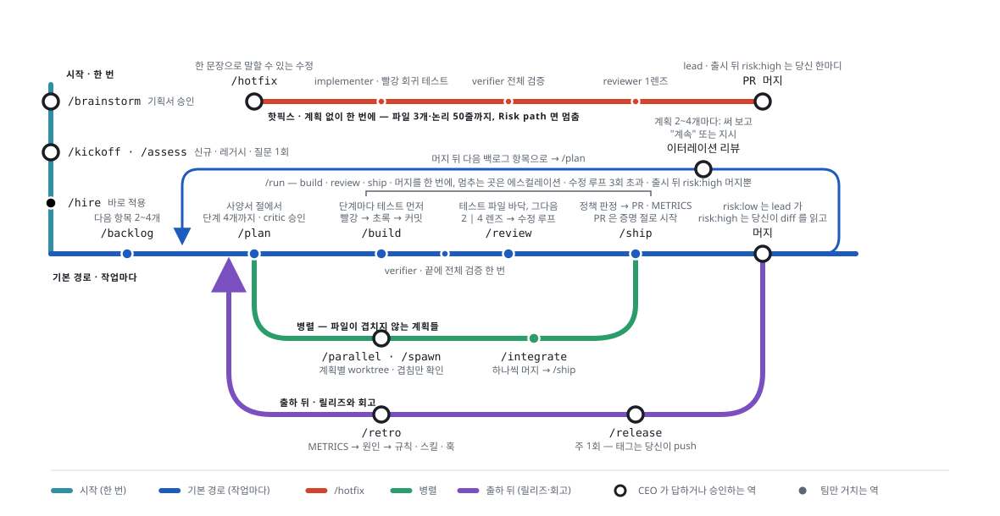

# GARAGISTE 사용 가이드 — opencode 판

> 영어 정본: [GUIDE.md](GUIDE.md). 에이전트 프롬프트는 영어이며, 응답·질문·문서 언어는 규칙 파일(AGENTS.md / CLAUDE.md)의 `## Language` 줄로 정합니다(첫 브레인스토밍 때 한 번 묻고, `/lang <code>`로 언제든 변경). 비어 있으면 당신이 쓰는 언어를 따릅니다.


이 문서는 사람(당신)을 위한 것이다. 팀이 무엇을 하는지가 아니라 **당신이 언제 무엇을 해야 하는지**만 적는다.
설정 파일의 의미는 README.md, 산출물의 위치는 docs/README.md 를 본다.

## 0. 한 장 요약

당신의 일은 셋이다. **방향을 정한다 / 제품을 본다 / 원하는 것을 말한다.**
그 외는 팀이 한다 — 사양서를 쓰고, 계획하고, 만들고, 리뷰하고, 저위험 작업은 스스로 머지하며, 계획 2~4개 이터레이션마다 멈춰 당신을 본다. 커맨드를 칠 필요는 없다. 말하면 lead가 절차를 돌린다. diff는 읽지 않는다. 출시 뒤에는 `risk:high` 작업(데이터·인터페이스·보안)이 PR의 리스크 요약을 보고 말하는 당신의 머지 또는 보류를 기다린다.



| 당신이 말하는 것 | 팀이 하는 것 | 당신이 하는 것 한 줄 |
|---|---|---|
| (첫 세션) 아이디어, 또는 직접 쓴 문서의 경로 | 함께 브레인스토밍하고 docs/BRIEF.md를 정리하고 사전 부검을 돈 뒤 한 라운드(비목표, 기본값, 지적)를 묻는다 | 자유롭게 이야기하고, 빈 슬롯에 솔직히 답하고, 기획서를 승인 — 당신이 승인하는 유일한 문서 |
| 기획서 뒤 "진행해" | `/kickoff`(레거시는 `/assess`): 질문 하나 — 스택과 예산 — 그다음 헌장·사양서·백로그·첫 계획·채용. 상태판에 `Mode: running` | 질문 하나에 답하고, 새 세션을 열어 "계속" |
| "어디까지 됐어?" | 상태판을 git과 대조해 답한다: 써 볼 수 있는 것, 바뀐 것, 당신을 기다리는 것 | 없음. main에서 제품을 켜 본다(상태판의 Run 줄) |
| "계속" | 다음 이터레이션(계획 2~4개: plan → build → review → ship → 머지)을 돌고 이터레이션 리뷰와 함께 멈춘다 | 리뷰를 읽고, 적힌 것을 써 보고, 원하는 것을 말한다 |
| "이거 추가하자"(기능, 당신 말로) | 당신 말로 사양서 절과 백로그 항목을 쓴다. 지금이라 하면 지금, 아니면 다음 이터레이션에 | 하고 싶은 말을 다 한다. 묻는 건 돈이 들거나 보안에 닿는 것뿐 |
| "이거 바꿔" / "이거 없애" | 사양서 절을 고치고 계획을 정리(재작업 · 수정 · 재계획)하고 이어간다 | 이야기한다. 묻는 건 머지된 작업을 버릴 때뿐 |
| "이거 버그야" | 한 문장에 확인이 자명하면 핫픽스, 아니면 다음 이터레이션 맨 앞에 `bug:` 계획 | 재현 조건을 준다 |
| "이거 먼저" | 백로그와 다음 이터레이션 순서를 바꾼다 | 그 외 없음 |
| "멈춰" | 진행 중 단계를 마치고 상태판을 커밋하고 기다린다(`Mode: paused`) | 다음에 원하는 것을 말한다 |
| (팀이 묻는다) | 에스컬레이션: 돈, 보안·사용자 데이터, 비목표 충돌, 수정 루프 3회 초과, 출시 뒤의 `risk:high` 머지 | "결정 / 선택지 / 추천 / 기본값" 형식으로 답한다. `risk:high` 머지는 PR의 리스크 요약을 읽고 머지 또는 보류라고 말한다 |
| (팀이 스스로 멈춘다) | 이터레이션 리뷰: 써 볼 수 있는 것 · 바뀐 것 · 확인 부탁 · 다음 이터레이션 | 써 본다. 그다음 "계속" 또는 지시 |
| (세션이 도중에 죽었다) | 첫 메시지에서 상태판을 git과 대조하고 이어간다. 다시 하는 건 최대 한 단계 | 세션을 열고 아무 말이나 한다 |
| `/spawn <계획들>` → `/integrate` | 계획별 worktree와 브랜치, 각각 세션, 순차 통합, PR 하나 | 파일이 겹치지 않을 때만. 처음 2주는 쓰지 않는다 |
| `/release [버전]` | 버전, CHANGELOG, 릴리즈 노트, 태그 명령 | 태그를 push |
| `/retro <대상>` | 원인 → 규칙·스킬·훅 | 위반 사례가 있는 한 줄 규칙만 승인 |
| `/hire`, `/roster`, `/recruit <gap>`, `/lang <code>` | 모델과 예산, 배정표, 새 역할, 작업 언어 | 뭔가 틀렸거나 예산이 바뀔 때만 |
| 아무 슬래시 커맨드 | 당신 말에 lead가 돌렸을 같은 절차 | 선택 사항 — 칠 필요는 없다 |

당신이 받는 질문은 이것뿐이다. 킥오프 때 스택과 예산 한 번; 돈이 드는 것(유료 서비스, 새 런타임 의존성); 보안·인증·사용자 데이터에 닿는 것; 기획서의 비목표를 넘는 요청; 머지된 작업을 버리게 하는 변경; 팀이 세 라운드에 못 닫은 수정 루프; 출시 뒤에는 `risk:high` 머지 — diff가 아니라 PR의 리스크 요약으로 정한다. 나머지는 팀이 기본값으로 정하고 docs/DECISIONS.md에 적으며, 거기서 읽을 수 있다.

## 1. 설치와 첫 실행


설치 위치는 세 가지 중 하나. 저장소 루트의 진입점에 대상(opencode)을 먼저 준다:
```
./install.sh opencode                       # 현재 경로(가 속한 git 레포 루트)
./install.sh opencode -Project <경로>       # 그 경로에 설치 (--project 도 됨)
./install.sh opencode -Global               # 전역
.\install.ps1 opencode -Project <경로>      # Windows PowerShell — 옵션 표기는 동일
```
`opencode/install.sh` 를 직접 실행해도 같다(대상 인자 없이).
- 경로가 레포의 하위 폴더면 git 루트로 올라가 설치하고 알려준다. git 저장소가 아니면 `git init` 을 제안한다.
- --global  → ~/.config/opencode (모든 레포). 전역 설치는 프로젝트의 .gitignore를 건드릴 수 없으니, 옛 설치가 `docs/STATUS.md`를 무시하게 해 두었다면 그 줄을 직접 지운다 — 상태판은 커밋된다.

**Windows 실행 정책**: `.\install.ps1` 이 "스크립트를 실행할 수 없으므로" 로 막히면 둘 중 하나.
- 한 번만: `powershell -ExecutionPolicy Bypass -File .\install.ps1`
- 영구(권장): `Set-ExecutionPolicy -Scope CurrentUser RemoteSigned` 후 `Unblock-File .\install.ps1` (인터넷에서 받은 파일 표식 제거)

**Windows 한글 깨짐**: 셋 중 어디서 깨지는지에 따라 다르다.
- `install.ps1` 출력만 깨진다 → 스크립트 인코딩 문제. 이 번들의 .ps1 은 UTF-8 BOM 으로 저장돼 있어 Windows PowerShell 5.1 에서도 정상이다. 직접 편집했다면 BOM 있는 UTF-8 로 저장.
- 터미널 전반(claude/opencode 출력, git log)이 깨진다 → 콘솔 인코딩. `$PROFILE` 에 다음 두 줄을 넣는다: `[Console]::InputEncoding = [Console]::OutputEncoding = [System.Text.UTF8Encoding]::new($false)` / `$OutputEncoding = [Console]::OutputEncoding`. 임시로는 `chcp 65001`.
- 글자가 □ 로 나온다 → 폰트. Windows Terminal 을 쓰고 한글 글리프가 있는 폰트(D2Coding, Sarasa Mono K, 또는 fallback 이 되는 Cascadia)로 설정. 옛 conhost + 래스터 폰트는 한글을 못 그린다.
- 근본 해결: Windows 설정 → 시간 및 언어 → 언어 → 관리 언어 설정 → 시스템 로캘 변경 → "Beta: 세계 언어 지원을 위해 Unicode UTF-8 사용" 체크(재부팅). 시스템 코드 페이지가 65001 이 된다. 일부 오래된 한국어 프로그램이 깨질 수 있으니 그런 게 있으면 위 프로필 방식으로.

**배치 권장**: 템플릿 zip 은 프로젝트 밖(예: `~\garagiste`)에 풀고, 프로젝트 루트에서 `& ~\garagiste\install.ps1 opencode -Project .` 처럼 호출한다. 프로젝트 안에 직접 풀어도 동작하지만(설치 스크립트가 감지해 복사를 건너뜀) 템플릿의 README.md 가 프로젝트 README 자리를 차지한다.

**git 저장소가 아닌 폴더**: 팀은 브랜치·커밋·worktree 를 전제로 한다. 설치 스크립트가 `git init`(기본 브랜치 main)을 제안하니 수락하면 된다.

첫 실행: 레포에서 `opencode` → Tab 으로 `team-lead` 선택 → 아이디어를 말한다(또는 직접 쓴 문서의 경로를 준다): lead가 함께 브레인스토밍하고 기획서를 정리한 뒤 질문 한 라운드(비목표 3개, 정해 둔 기본값, critic 지적)를 묻고 승인을 청한다 → 승인이 킥오프를 시작한다: 질문 하나(스택과 예산), 그다음 팀이 헌장·스택 ADR·규칙 파일·핵심 사양서·백로그·첫 계획(첫 단계가 골격)을 쓰고 상태판을 `Mode: running`으로 남긴다 → 새 세션을 열고(모델 배정은 세션 시작 때 로드된다) "계속".
확인할 것: `/kickoff` 등이 커맨드 목록에 보이는지, docs/CHARTER.md 와 docs/STATUS.md 가 생기면 세션 시작에 주입되는지(opencode.json 의 `instructions`).

**권한**: 팀의 안전장치는 프롬프트가 아니라 에이전트의 permission 블록과 가드레일 플러그인이다. 팀 에이전트는 명시적 allow/deny를 갖고 있어 팀 안에서는 아무것도 당신에게 묻지 않는다. 내장 build/plan 에이전트는 전역 기본값(ask)을 따른다. 헤드리스 실행(`opencode run`)에서는 프롬프트가 뜰 수 없다. 가드레일 메시지가 막았다고 말하는 것을 permission 블록을 넓혀 허용하지는 말 것 — 그게 경계가 작동하는 모습이다.

### 모델·예산 — `/hire`
`/kickoff` 또는 `/assess` 가 끝나면 lead 가 `/hire` 를 제안한다. 실행하면 거기서 답한 예산 티어와 기획서의 프로젝트 성격으로 사용 가능한 모델(`opencode models`)을 확인하고 역할 × 모델 표를 이유와 함께 만들어 바로 적용한다 — 두 번 묻지 않는다. 배정표가 보이고, 한 줄 바꾸려면 말하면 된다. 예산이 바뀌면 `/hire` 를 직접 실행한다(그때는 티어를 묻는다). 원칙: 판단하는 자리(planner·critic·reviewer)에 강한 모델, verifier 는 가장 빠른 모델, implementer 는 예산에 따라. 스크립트가 `model:` 줄만 바꾸고 AGENTS.md 에 "운영 프로필"이 남으며, 새 세션부터 반영된다. 현재 배정은 `/roster` 로 본다.

### 언어
에이전트 프롬프트는 영어다. 응답·질문·문서는 AGENTS.md의 `## Language` 줄을 따른다. 첫 브레인스토밍 때 lead가 한 번 묻고, `/lang <code>`로 언제든 바꾼다(스크립트가 그 절만 다시 쓴다). 비어 있을 때 에이전트는 당신의 마지막 메시지 언어를 따르지만, 영어 명령 템플릿 때문에 lead가 영어로 넘어갈 수 있다. 그러면 말하거나 `/lang`을 실행한다.

## 2. 팀은 당신 없이 이렇게 돈다

- **당신 것인 문서는 기획서 하나다.** docs/BRIEF.md가 당신이 승인한 것이다. 팀은 거기서 헌장(모든 계획을 재는 헌법)을 도출하고, 기획서와 부록에 남은 당신 말로 사양서 — docs/specs/, 기능마다 파일 하나(F1, F2, …), 색인은 docs/SPEC.md — 를 쓴다. 빈 슬롯은 기본값과 docs/DECISIONS.md 한 줄로 채우지 질문하지 않는다. 에스컬레이션 목록에 있는 것만 예외다.
- **일은 이터레이션으로 돈다.** lead가 합쳐서 써 볼 수 있는 백로그 항목 2~4개를 고르고, 항목마다 사양서 절에서 계획(critic이 모든 계획을 보고 APPROVE가 곧 승인) → build → review → ship → 머지. 끝나면 이터레이션 리뷰를 쓰고 멈춘다. `risk:high` PR은 당신이 머지할 때까지 이터레이션을 멈춘다. 다음 계획이 그 위에 쌓일 수 있어서다.
- **모든 단계는 다음 단계 전에 증명된다.** 논리 단계는 쉬운 말로 쓴 `proves:` 줄 하나에서 넷을 갖고, 각각 변경 전엔 빨강, 후엔 초록인 테스트가 된다. UI 단계는 `shows:` 줄도 갖는다 — 화면과 네 가지 상태(빈/로딩/에러/성공) — 리뷰어가 보는 스크린샷으로 증명한다. verifier는 build 끝, 리뷰 수정 뒤, 출하 전에 전체를 돌린다.
- **리뷰는 렌즈별이고, 렌즈는 기계적이다.** correctness와 security는 항상, performance와 maintainability는 위험이 높거나 diff가 클 때, ux 렌즈는 diff가 UI 경로에 닿을 때마다. 위험은 규칙 파일의 "Risk paths"와의 파일 대조이지 의견이 아니다. 팀은 올릴 수만 있고 걸린 것을 내리지 못한다.
- **머지는 저장소를 따른다.** 원격 없음 → 로컬 머지, 원격 있음 → PR. 어느 경우든 검증·리뷰·체크가 초록인 `risk:low` 작업은 lead가 머지한다 — 출시 전에는 `risk:high`도 그렇다(머지 메시지와 docs/DECISIONS.md에 기록되고 Check please로 보여 준다). 출시 뒤 `risk:high`는 당신의 한마디를 기다리며, PR의 리스크 요약을 보고 말한다. main은 항상 실행 가능하다. 상태판의 Run 줄이 제품을 켜는 법이다.
- **상태판이 당신의 창이다.** docs/STATUS.md(매 세션 시작에 주입, 끊는 지점마다 커밋)에 Mode, 이터레이션, 써 볼 수 있는 것, 팀이 눈길을 청하는 것, 당신을 기다리는 것, 다음 할 일이 있다. 어긋나면 git이 진실이다.
- **세션은 끝나도 일은 안 끝난다.** lead는 매 세션 첫 메시지에서 상태판을 git과 대조하고, Mode가 running이면 스스로 이어간다. 끊김의 비용은 최대 진행 중이던 한 단계다. lead 컨텍스트에 컴팩션 요약이 있으면 단계를 마치고 상태판을 커밋하고 새 세션을 청한다.
- **실패는 환류된다.** 계획마다의 지표(재작업, 질문, 테스트, 소요)는 docs/METRICS.md로 가고, `/retro`가 반복된 실패를 한 줄 규칙·스킬·훅으로 바꾼다 — 사고가 뒤에 있는 것만.

## 3. 상황별 가이드

각 항목은 같은 틀이다: 언제 / 당신이 말하는 것 / 팀이 하는 일 / **당신이 하는 일** / 조심할 것.

### 3.1 제품 시작
- 언제: 레포가 비어 있거나 코드보다 아이디어가 먼저일 때.
- 당신이 말하는 것: 첫 세션에서 아이디어 — 또는 직접 쓴 문서면 "여기 문서 있어: <경로>".
- 팀: 브레인스토밍(lead가 제안하고 반박한다; 어젠다 없음) 또는 가져온 문서의 정리 → "기획서 만들어줘" → docs/BRIEF.md 작성(채택 / 나중 / 기각과 이유; 흐름과 화면에 대한 당신 말은 부록에 그대로; 당신이 정하지 않은 슬롯은 기본값)과 critic 사전 부검을 한 번에 → 질문 한 라운드: 비목표, 확인할 기본값, 부검 결과 → 승인 → 문서 커밋과 같은 턴에 `/kickoff` — 헌장 도출(기본값은 기록), 디자인 기반과 보안 기준선을 담은 스택 ADR, 질문 하나(스택, 예산, 그리고 돈이 들거나 보안에 닿는 미결 항목만), AGENTS.md, 핵심 사양서, 백로그, 첫 단계가 골격인 walking skeleton 계획, ADR·사양서·계획을 한 번에 보는 critic 리뷰, 예산 답으로 채용 적용, 상태판은 `Mode: running`. 이터레이션 1 전에는 코드를 쓰지 않는다.
- 당신: 채팅에서 하듯 이야기하고, 기능에 대해 아는 걸 다 말한다 — 그대로 남아 사양서가 되고, 아무도 다시 묻지 않는다. 한 라운드의 질문에 솔직히 답한다. **구체적인 비목표 3개**는 당신만 줄 수 있는 것이고 이후 모든 판정의 기준이다. 성공 지표와 접는 기준은 기본값이 붙어 오니 확인하거나 바꾼다. 기획서를 승인한다. 승인이 곧 진행이다. 킥오프에서는 ADR의 "왜 다른 대안이 아닌가"를 읽고 질문 하나에 답한다. 그다음 새 세션을 열고 "계속".
- 조심할 것: 읽지 않고 그대로 둔 성공 지표 기본값. 무엇을 왜 기각했는지 없는 기획서. 스택 결정을 팀에 통째로 맡기는 것 — 되돌리기 가장 비싼 결정이다. 나중에 방향이 바뀌면 말하면 된다. lead가 기획서를 개정하고 헌장과 사양서가 따라온다.

### 3.2 레거시 인수
- 언제: 기존 코드가 있고 고치거나 갈아엎어야 할 때.
- 당신이 말하는 것: 왜 리빌드하나, 목표 상태, 바뀌면 안 되는 것, 기한 — 한 문단과 "기획서 만들어줘"면 충분하다. 그다음 "진행해", lead가 물으면 경로.
- 팀: 짧은 리빌드 기획서(Kind: 레거시) → `/assess`: 인벤토리(docs/ASSESSMENT.md; 기획서와 충돌하는 "버그로 보이는 동작"은 표시된다) 와 AGENTS.md의 명령(verifier가 바로 돌린다) → 보존/수정 방침을 한 번에 → 헌장과 전략 ADR → 질문 하나(전략과 예산) → docs/REBUILD_PLAN.md, 결정 기록, 첫 seam의 parity harness 계획을 planner 한 호출로 → ADR·리빌드 계획·하네스 계획을 한 번에 보는 critic 리뷰 → 문서 커밋 → 채용 → 상태판은 `Mode: running`. 이후 리빌드 단계마다 그 단계의 seam까지 하네스를 먼저 확장한다.
- 당신: 결정 둘. (1) "버그로 보이는 현재 동작"을 보존할지 수정할지 — 기본값이 채워진 질문 한 번: 기본값을 수락하거나 수정할 항목을 지목한다. (2) 전략(strangler fig / 모듈별 교체 / 전면 재작성), 같은 질문에 예산도 답한다. 기본값은 strangler fig이고, 전면 재작성은 팀이 근거를 대야 한다.
- 조심할 것: 레거시로 PASS인 parity harness 없는 리빌드 단계(docs/PARITY.md에 범위가 적혀 있다) — 팀도 시작하지 않고, 당신도 시키지 않는다. 문서화된 사양서가 없는 레거시에서 사양은 현재 동작뿐이다. 그 너머에서 달라져야 할 것은 기획서만이 말한다.

### 3.3 진행 보기
- 언제: 아무 때나.
- 당신이 말하는 것: "어디까지 됐어?" — 또는 아무것도: 상태판(docs/STATUS.md)을 열거나 상태판의 Run 줄로 main에서 제품을 켠다.
- 팀: 이터레이션마다 끝에 리뷰 — 써 볼 수 있는 것(실행 명령과 써 볼 것), 이번에 바뀐 것, 확인 부탁(눈길을 청하는 것: 아직 못 본 화면, 이제 시험할 수 있게 된 기획서의 가장 위험한 가정, 당신 뜻인지 확신이 없는 것), 다음 이터레이션. 리뷰 사이에도 상태판의 "써 볼 수 있는 것"은 계획이 머지될 때마다 늘어난다.
- 당신: 제품을 써 본다. 계획·PR·사양서는 읽고 싶을 때만 읽는다. critic·reviewer·verifier가 읽었다. 그다음 원하는 것을 말한다 — "계속", 또는 지시.
- 조심할 것: "확인 부탁" 줄 — 팀이 스스로 못 내리는 판단을 청하는 것이니 "계속" 전에 답한다. 써 볼 수 있다는데 안 되는 것은 버그 보고다. 무엇을 했고 어떻게 됐는지 말한다.

### 3.4 기능 추가·변경
- 언제: 제품을 써 본 뒤, 또는 아이디어가 생겼을 때.
- 당신이 말하는 것: "이거 추가하자", "이거 바꿔", "이거 없애", "이 화면 이렇게 말고 저렇게" — 당신 말로, 길이는 자유. 한 문장으로 분명한 지시는 바로 실행되고, 긴 설명은 "정리해줘"나 "진행해"라고 할 때까지 듣는다.
- 팀: 분류하고(제품 방향 → 기획서, 기능의 동작이나 화면 → 그 사양서 절, 새 기능 → 새 절과 백로그 항목, 우선순위 → 백로그), planner가 당신 말로 적고, 영향을 보고하고 — 머지된 작업 중 무효가 되는 것, 진행 중 계획 중 닿는 것, 미시작 계획 중 바뀌는 것 — 계획을 정리하고(재작업 항목, 마지막 통과 단계 뒤의 수정, 재계획), critic이 바뀐 절을 보고, 이어간다. 지금이라 했으면 지금, 아니면 다음 이터레이션 맨 앞에.
- 당신: lead가 되물으면 이야기한다(대안과 비용을 말한다). 한 줄 확인을 청하면 확인한다. 질문은 머지된 작업을 버리게 될 때 하나뿐이다 — 어느 계획의 무엇이 날아가는지, 기본값은 진행.
- 조심할 것: 감상("이 화면 좀 별로네")은 지시가 아니다 — lead가 "바꿀까요?"라고 묻고 기다린다. 그 뜻이었으면 말한다. 기획서의 비목표를 넘는 변경은 계획 대신 "그건 기획서 개정"이라는 답을 받는다. 그때는 브레인스토밍을 다시 한다.

### 3.5 버그
- 언제: 뭔가 안 될 때.
- 당신이 말하는 것: "이거 버그야"와 함께 무엇을 했고 어떻게 됐고 무엇을 기대했는지 — 입력, 환경, 언제부터. "가끔 이상함"은 계획이 못 된다.
- 팀: 한 문장에 확인이 자명하면(재현 있는 결함, 잘못된 문구·값·기본값) → `/hotfix`: 수정 전에 실패하는 회귀 테스트, 수정, 전체 검증, 리뷰 1렌즈, `risk:low`로 머지 — 이터레이션이 이어지기 전에. 나머지 → 다음 이터레이션 맨 앞에 `/plan bug: …`(지금이라 하면 지금): 조사 → 가설 → 실패하는 재현 테스트 → 수정 → 리뷰.
- 당신: 재현 조건을 준다. 팀이 실패하는 테스트 없이 수정으로 직행하면 되돌린다.
- 조심할 것: 같은 영역에 핫픽스 세 번 — 그건 계획이고 회고 대상이다(METRICS에 `hotfix:` 줄이 쌓인다). 증상만 가리는 수정.

### 3.6 우선순위와 백로그
- 언제: 다음에 뭐가 중요한지 알 때.
- 당신이 말하는 것: "이거 먼저", "이건 나중에", "이건 빼" — 또는 아무것도: 팀은 백로그를 자기 순서로 집는다(재작업·버그 항목 먼저, 그다음 헌장 기준 우선순위).
- 팀: docs/BACKLOG.md에 모든 항목이 완료 조건과 `spec:` 링크와 함께 있고, planner가 정리하며(기획서의 "나중" 줄과 사양서 절의 아직 안 덮인 완료 조건을 훑는다), 상태판의 "다음 이터레이션" 줄이 다음을 말한다.
- 당신: 순서는 말로 바꾼다. 항목 하나가 하루를 넘길 것 같으면 "쪼개라" — planner가 층이 아니라 써 볼 수 있는 결과 단위로 자른다.
- 조심할 것: 백로그를 팀에 안 맡기고 머릿속에 두기. 그러면 헌장과의 충돌을 아무도 못 잡는다.

### 3.7 팀이 물을 때
- 언제: 에스컬레이션 — 0절의 목록 — 또는 출시 뒤의 `risk:high` PR.
- 팀: 한 번에 질문 하나, "결정 / 선택지 2~3개 / 이유 있는 추천 / 무응답 시 기본값" 형식. 상태판의 CEO 대기 줄에 남으니 새 세션도 다시 묻는다. `risk:high` PR이면 리스크 요약 — Risk path 위의 파일과 바뀐 것, 깨질 수 있는 것, 렌즈마다 확인한 것, 부정 케이스 테스트, 롤백 — 과 두 가지 답, 머지 또는 보류. diff는 읽지 않는다. 렌즈 넷이 읽었다.
- 당신: 추천을 따르거나 이유를 대고 바꾼다. PR은 4절 체크리스트로 보고 직접 머지한다. 이터레이션이 그것을 기다린다.
- 조심할 것: 같은 질문 두 번 — 결정은 docs/DECISIONS.md에 있고 lead는 따라야 한다. 다시 물으면 회고 대상이다. 에스컬레이션 목록 밖의 질문도 마찬가지다.

### 3.8 병합과 릴리즈
- lead 머지: 아래 어느 정책이든 검증·리뷰·체크가 초록인 `risk:low` 작업은 lead가 묻지 않고 머지한다. 상태판의 Stage가 `pre-launch`인 동안은 `risk:high`(Risk path 적중, 에스컬레이션 항목)도 그렇다. `live`가 되면 리스크 요약을 보고 말하는 당신의 머지 또는 보류를 기다린다. 머지는 어느 경우든 lead가 한다 — 당신이 GitHub를 열 일은 없다.
- main 머지는 저장소 상태를 따른다(`/ship`이 판정하고 `/policy`가 판정과 근거를 보여 준다):
  - 원격 없음 → `local`: PR 설명이 docs/prs/NNNN-<slug>.md로 남고 lead가 `merge --no-ff`로 로컬 머지한다(출시 뒤의 `risk:high`는 당신 한마디 뒤).
  - 원격 있음, 보호 없음 → `manual`: 팀이 push하고 PR을 열고 체크 통과 후 위 규칙대로 머지한다. 출시 뒤의 `risk:high`는 당신 한마디를 기다린다.
  - 원격 + main 보호(필수 체크 = CI) + auto-merge 허용 → `auto-low-risk`: `risk:low`는 CI 통과 시 자동 머지.
- 팀은 어느 판정에서도 force push와 main 직접 push를 못 한다(훅). 머지는 항상 PR 또는 위 규칙의 로컬 머지를 통과한다.
- **GitHub를 붙이는 날**: `git remote add origin …`과 첫 push. `/ship`이 스스로 PR 흐름으로 바뀐다. 브랜치 보호를 켠다. lead의 `risk:low` 머지는 프롬프트 규칙이고, 필수 체크가 있는 보호가 그것을 저장소 규칙으로 만든다.
- `/release [버전]`: 버전 제안 → 전체 검증 → CHANGELOG 확정 → docs/releases/<버전>.md → 태그 명령을 당신이 실행. 인터페이스가 바뀌었으면 major/minor 질문이 온다. 릴리즈 노트는 사용자 관점이다 — 무엇이 달라지나, 알려진 문제, 롤백.
- 조심할 것: 브랜치 보호 없이 auto-merge 켜기. 충돌 해소를 correctness 재리뷰 없이 머지하기(팀이 재리뷰한다. 확인).

### 3.9 세션: 멈춤, 재개, 끊김
- 끝내기: "멈춰"라고 한다 — 팀이 진행 중 단계를 마치고 상태판을 커밋하고(`Mode: paused — stopped by CEO`) 기다린다. `/handoff`도 같고, 진행 중 작업을 `wip:`으로 커밋까지 한다. 이터레이션이 끝난 뒤엔 아무것도 필요 없다. 상태판과 커밋이 이미 있다.
- 재개: 세션을 열고 아무 말이나 한다. lead가 먼저 상태판을 git·worktree·PR 상태와 대조하고(저장소가 이긴다) Mode대로 움직인다. running → 이터레이션을 잇는다. paused → 이터레이션 리뷰를 다시 보여 주고 기다린다. 당신 대기 → 질문을 다시 한다.
- 끊김(Esc, 오류, 사용량 한도, 창 닫힘): 끝난 단계는 전부 커밋이고 상태판도 끊는 지점마다 커밋되므로, 다음 세션이 git에서 복구해 진행 중이던 단계만 다시 한다. 할 말이 있어 끊었다면 lead가 먼저 대조하고 그다음 듣는다.
- 컴팩션: 컴팩션 플러그인이 요약에 표시를 남기고 lead는 그것을 신호로 삼는다 — 단계를 마치고 상태판을 커밋하고 새 세션을 청한다. 요약 위에 요약이 쌓이면 품질이 떨어지니 기본은 새 세션이다 — 한 세션 = 한 이터레이션. `opencode -c`는 짧게 끊긴 경우만.
- 옛 흐름에서 docs/STATUS.md를 git-ignore했던 프로젝트를 올릴 때: 설치 스크립트를 다시 실행한다(.gitignore 줄을 지운다). 다음 이정표 커밋이 상태판을 저장소에 넣는다.

### 3.10 팀이 헛돌 때
- 신호: 같은 실패 3회, 질문이 반복됨, diff가 계획과 무관하게 커짐.
- 당신이 하는 것, 순서대로:
  1. "멈춰"라고 한다. 고치려고 대화로 끌고 가지 않는다.
  2. 새 세션을 열고 본 것을 말한다 — lead가 먼저 대조하고 그다음 듣는다.
  3. 그래도 같은 지점에서 막히면 계획이 틀린 것이다. "이 계획 다시 짜, 단계를 더 잘게"라고 한다.
  4. 환경 문제(의존성, 권한, 명령 불일치)면 verifier 보고에 "환경 문제"로 나온다 — 이건 당신이 직접 고친다.
  5. 두 번째 반복이면 `/retro`. 느림·비용이 문제면 `/hire`로 배정을 바꾼다.
- 조심할 것: 헛도는 세션에 "다시 해봐"를 반복. 컨텍스트가 오염된 세션은 살릴수록 나빠진다.

### 3.11 회고
- 언제: 같은 실수가 두 번, 머지된 작업을 버리게 한 변경, 장애 후, 릴리즈 후.
- 당신이 말하는 것: `/retro <계획 slug | 세션 | 사건>` — 또는 "회고 하자".
- 팀: docs/METRICS.md 추세를 먼저 본다(재작업, 질문, 계획당 테스트, 소요; 머지된 slug를 가리키는 `bug:` 계획; 쌓이는 `hotfix:` 줄) → 재작업·검증 실패·리뷰 blocker·당신의 개입이 난 지점을 3개 이내로 특정, 근본 원인 → 원인마다 재발 방지책과 그것이 박힐 자리(AGENTS.md 한 줄 / 스킬 / 물리적으로 막는 훅 / "Risk paths"나 "UI paths" glob / 계획 형식 / 에이전트 memory) 제안 → 승인된 것만 반영.
- 당신: **위반 사례가 있는 규칙만** 승인한다. 일반론("항상 신중하게")은 거절한다. AGENTS.md이 300줄을 넘기 시작하면 절차를 스킬로 빼라고 한다.
- 조심할 것: 회고 없이 같은 프롬프트를 반복하기. 규칙을 잔뜩 승인해 AGENTS.md을 비대하게 만들기.

### 3.12 병렬 작업 (고급)
- 언제: 파일 단위로 서로 독립적인 기능이 둘 이상 있고, 순차로는 시간이 아까울 때. **처음 2주는 쓰지 않는다.**
- 한 가지 방식: `/spawn <계획 파일들>`이 승인된 계획마다 worktree와 브랜치를 만들고 거기서 세션을 여는 명령을 알려 준다. 그 세션에서 `/build <계획>`이 자기 브랜치에서 구현한다. 상태판은 메인 체크아웃 것이고 worktree 세션은 편집하지 않는다.
- 그다음 메인 세션에서 `/integrate`가 끝난 브랜치를 통합 브랜치에 하나씩 리뷰·머지하고 `/ship`이 그 브랜치를 PR 하나로 출하한다. opencode에는 세션 내 builder가 없다. 병렬 계획은 각각 세션이고, 계획 도중 끊긴 세션은 그 브랜치에서 마지막 커밋 다음 단계부터 잇는다.
- 전제: `.opencode/`와 `opencode.json`이 커밋되어 있어야 worktree 세션에도 팀이 있다(또는 전역 설치). `.env` 같은 미추적 파일은 직접 복사한다.
- 당신: 각 계획의 "변경 파일" 집합이 겹치지 않는지 확인하고, 통합 순서(의존이 있으면 먼저)를 정한다. 겹치는 파일이 0개여야 하고, 아니면 순차로 돌린다.
- 조심할 것: 한 기능의 단계들을 병렬로 나누기(단계는 순차다). 통합을 여러 브랜치 동시에 하기(항상 하나씩).

### 3.13 전문가 커맨드
모든 슬래시 커맨드는 여전히 동작하고, 당신 말에 lead가 돌렸을 같은 절차를 돈다. 한 단계만 따로 보고 싶을 때 쓴다:

| 커맨드 | 하는 일 |
|---|---|
| `/plan <항목 또는 F<n> 또는 bug: …>` · `/plan <F<n> 또는 계획 파일> 수정: …` | 사양서 절에서 계획 하나, critic의 APPROVE가 승인 · 절이나 계획의 개정 |
| `/run <계획>` · `/build` · `/review` · `/ship` | 계획을 끝까지 · 한 단계씩 |
| `/hotfix <무엇을 왜>` | 계획 파일 없이 한 번에 |
| `/backlog [아이디어]` · `/policy [판정]` · `/roster` | 정리 · 머지 정책 판정이나 override · 팀 표 |
| `/handoff [메모]` · `/resume [메모]` | 도중에 멈춤 · 직접 대조(세션 시작 때 lead가 스스로 한다) |
| `/brainstorm`, `/kickoff`, `/assess <경로>`, `/deliver` | 첫 세션, "진행해", "계속" 뒤에 있는 절차 |

## 4. 체크리스트

기획서를 승인하기 전:
- [ ] 성공 지표가 숫자이거나 관찰 가능한 사실이다 (기본값이어도 되니 읽어 본다)
- [ ] 구체적인 비목표가 3개 이상 있다. 접는 기준은 있으면 적는다
- [ ] "채택"은 역량 한 줄씩이고, 당신이 말한 흐름과 화면은 부록에 그대로 있다
- [ ] 기각된 아이디어마다 이유가 있다
- [ ] 미정 항목마다 언제 정할지 적혀 있다
- [ ] Kind가 신규 또는 레거시(경로)로 적혀 있어 다음 단계가 분명하다

critic이 모든 계획에 요구하는 것(당신은 계획을 승인하지 않는다 — APPROVE의 뜻이다):
- [ ] 완료 조건이 검증 가능한 문장이다 (명령·테스트·수치)
- [ ] 논리 단계마다 쉬운 말로 쓴 "증명" 줄이 하나에서 넷 있고(아니면 사유가 있는 `n/a`) 검증 명령이 있다. UI 단계는 네 가지 상태의 "shows" 줄이 있다. Risk path 계획은 위협 모델 줄과 진입점마다 부정 케이스 테스트가 있다
- [ ] 논리 변경 단계는 단계 크기 목표(기본 300줄, 테스트 제외) 안이거나 넘는 사유가 있다. 기계적 변경은 별도 단계다
- [ ] 논리 단계가 계획 크기 목표(기본 4개) 이하이거나 Steps 줄에 사유가 있다. 쪼갰다면 층이 아니라 써 볼 수 있는 결과 단위로 쪼갰다
- [ ] 비목표·헌장과 충돌하지 않는다
- [ ] 롤백 방법이 적혀 있다
- [ ] 1~2절이 사양서 절의 완료 조건과 이번엔 제외 그대로다

출시 뒤 `risk:high` PR에 머지라고 말하기 전(당신 몫인 유일한 머지 결정):
- [ ] 검증 증거에 실행 명령과 실패 0건이 적혀 있다 (테스트 개수 0이면 거부)
- [ ] "증명" 절에 증명 줄마다 테스트가 빨강→초록과 함께 적혀 있다. 의심되면 그 명령을 직접 돌려 본다
- [ ] 리뷰 지적과 처리 내역이 있다
- [ ] 리스크 요약에 Risk path 위의 파일과 깨질 수 있는 것이 적혀 있고, 이해했다
- [ ] correctness 렌즈가 테스트가 진짜라고 보고했다 — skip·약화·옛 코드에서도 통과하는 것 없음
- [ ] 기계적 커밋(scaffold/gen/mechanical/deps)에 논리 변경이 섞여 있지 않고, gen은 재생성 diff 0이다
- [ ] 롤백 방법이 있다

## 5. 토큰이 새는 곳과 막는 법
- subagent 상태를 반복 확인: lead 규칙으로 금지했다(동기 호출, 완료까지 대기). 그래도 보이면 `/retro` 대상이다.
- 진행 서술("이제 …하겠습니다"): 규칙으로 금지. 결과와 결정만 말하게 한다.
- 자동 주입 문서가 비대해짐: CHARTER 60줄·STATUS 40줄 상한. STATUS는 lead가 상한 안에 유지하고, CHARTER는 넘치면 planner가 분리한다 — opencode에는 강제 상한이 없어서 이 선을 넘긴 파일은 그대로 매 세션 전체가 주입된다.
- 계획은 질문을 끌지 않는다: 출처는 사양서 절·버그 줄·당신 말이고 planner의 기본값은 기록된다. `/plan`이 에스컬레이션 목록 밖의 것을 물으면 `/retro` 대상이다.
- 단계마다 verifier: 기본은 끔 — implementer의 빨강→초록 보고가 단계를 지고, verifier는 build 끝·리뷰 수정 뒤·출하 전에 전체 검증으로 돈다. 단계마다 독립된 빠른 검증을 원하면 운영 프로필(`/hire`)에서 켠다. risk:high와 레거시 계획은 어차피 돈다.
- 렌즈: 기본 둘, 위험이 높거나 diff가 크면 넷, UI paths에 걸리면 ux 렌즈. 전부 기계적이고 전부 운영 프로필로 조정한다.
- 컴팩션: 컴팩션 플러그인이 요약에 표시를 남기고 lead가 진행 중 단계 뒤에 세션을 끝낸다 — 당신이 알아챌 필요가 없다.
- 브레인스토밍과 수정 논의는 짧은 대화 원칙의 예외다: 다 말하고, 문서는 붙여 넣는 대신 경로와 링크를 준다(planner가 읽는다). planner가 열 턴쯤마다 화이트보드를 남기니 잃는 것이 없다.
- 당신 쪽: 같은 질문을 세션마다 다시 하지 않기 — 결정은 docs/DECISIONS.md에 있고 lead가 따른다. 한 세션에 이터레이션 하나. 컨텍스트가 무거워지면 "멈춰"하고 새로 연다 — 상태판이 커밋되니 세션 사이에 잃는 것이 없다.

## 6. 하지 말 것
- 계획 없이 큰 작업을 채팅으로 시키기(`/plan <그것>`이라고 하면 팀이 절과 계획을 쓴다)
- 출시 뒤 `risk:high` PR에 리스크 요약을 읽지 않고 머지라고 말하기
- 감상을 지시로 취급하거나 팀이 그러길 기대하기(바꾸려면 "바꿔"라고 말한다)
- 팀이 일하는 도중 채팅으로 방향 바꾸기("멈춰"라고 한 뒤 바뀐 것을 말한다)
- 리뷰어 지적을 직접 고치기(lead에게 말한다. implementer가 고친다)
- 헛도는 세션을 살리려 하기
- 브랜치 보호 없이 자동 머지 켜기
- 회고에서 일반론 규칙을 승인하기
- AGENTS.md의 검증 명령을 실제와 다르게 두기
